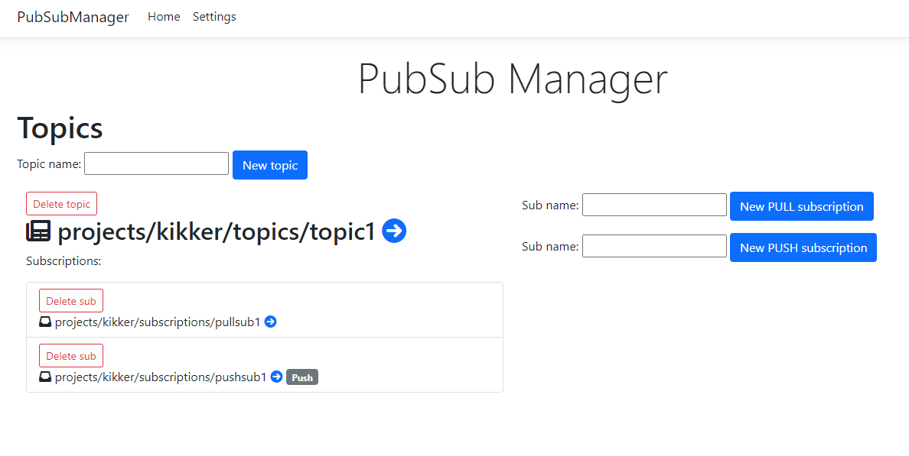
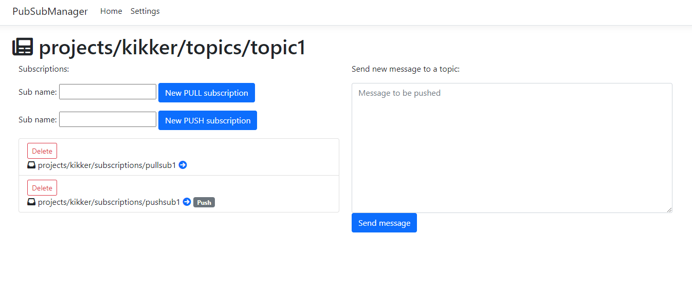
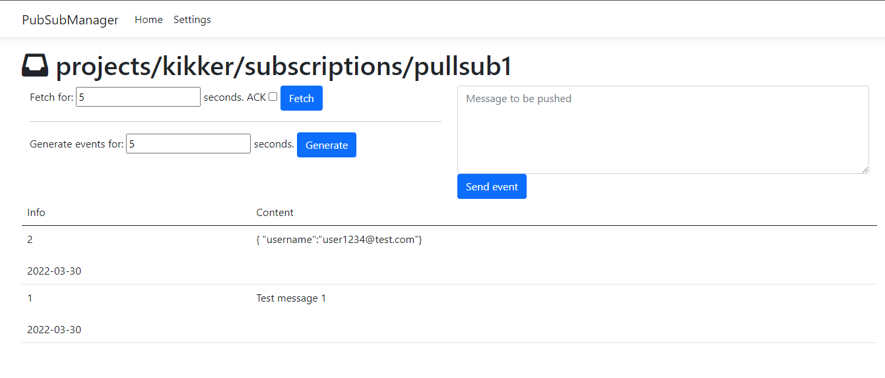

# Google Cloud Pub/Sub (Emulator) Manager

## Audience?

This tool is intended for anyone that is using PubSub Emulator.
It is trying to help developers in everyday dev tasks:

* Create and overview of Topics and Subscriptions
* Verification of message content that is pushed to a PubSub (Emulator)
* Simulating PUSH events

## Startup

First you need to have Google Cloud Pub/Sub Emulator running.

```
gcloud beta emulators pubsub start --project={your_project_name}
```

More info on setup and pre-requisites: [https://cloud.google.com/pubsub/docs/emulator](https://cloud.google.com/pubsub/docs/emulator)

In theory - this whole application can even run against the classic cloud Pub/Sub - but then you need to obtain service account JSON key files and place them on the environment.

Start up this app - either just run it (build/run from Visual Studio), or use `Dockerfile` to build it and run as a Docker container.

Environment variables for Docker container:

* `PUBSUB_EMULATOR_HOST` - this is the url of the PubSub emulator (by default it is `http://localhost:8085`)
* `PUBSUB_PROJECT_ID` - this is the projec id that you used when you were starting up Pub/Sub
* `EVENT_DESTINATION_URL` - this is destination url that will be used to send `PUSH` subscriptions (`POST` events)

## Create topics/subscriptions



On the home page - you can see buttons to create new topics and new subscriptions under the topic.

When making subscriptions you have options to create `PULL` ("standard") or `PUSH` subscriptions.

## What is a PUSH subscription?

PUSH subscription will take any incoming message and generate a `POST` request that will send out to the destination url (the one defined in the environment variable).

Format of the `POST` message:

```json
{
  "subscription": "projects/my-project/subscriptions/my-subscription",
  "message": {
    "@type": "type.googleapis.com/google.pubsub.v1.PubsubMessage",
    "attributes": {
      "attr1":"attr1-value"
    },
    "data": "dGVzdCBtZXNzYWdlIDM=",
    "messageId": "message-id",
    "publishTime":"2021-02-05T04:06:14.109Z"
  }
}
```

Where `data` field contains the Base64 encoded message content.

### Note about the _Emulator PUSH_

According to Google spec - the message that is sent as a `POST` also has several additional `ce-` headers. Those headers are very important if you are using a Google client library to process incoming `POST` messages.

More info about these headers - [https://cloud.google.com/eventarc/docs/cloudevents#payload-format](https://cloud.google.com/eventarc/docs/cloudevents#payload-format)

I don't know why - but the _Emulator_ does not send those headers! So - if you want to use the emulator in your testing pipeline - be very careful!

## Pushing new message to a Topic

When you open the page of a single topic - you can send new message to it (message will be replicated in all the subscriptions that belong to a topic).



## Reading messages from PULL subscription

When you click on the subscription - you will have an option to PULL certain amount of messages (you give the time period). With this - you can see the message content (to verify if your message is properly serialized for example).

If you want to "drain" the subscription - then you can select checkbox to automatically `ACK` all those messages. This will remove them from subscription.



## Manually simulating a PUSH

When you open the subscription page - you can type any custom message and simulate a PUSH. This is just emulated `POST` request to your defined `EVENT_DESTINATION_URL`, but it does include all the `ce-` headers so you can test your consumer application.

## Converting PULL to PUSH

Once you have manually confirmed that your messages are serialized properly - you can click on _Generate events_ button. This will read messages from the PULL subscriptions for some period of time. After that - it will create a `POST` message to the destination url. Because this is "manual" `POST` it will include all the necessary `ce-` headers.

## Changing settings while running

You don't have to restart the application if you want to change for example a destination url. You can do it on the settings page.

However! - keep in mind that if you already created a PUSH subscription - the old url will still remain on it. Once the PUSH subscription is created - its not changed anymore.

## Disclaimer

Code and UI are pretty janky - but it works well enough for development and testing 